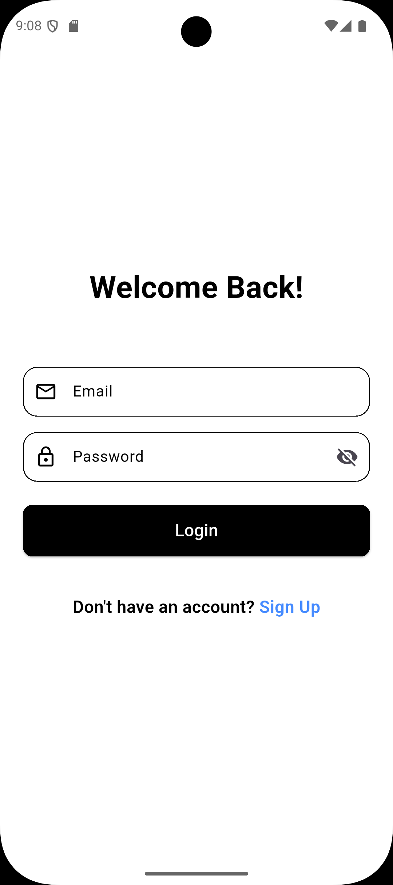
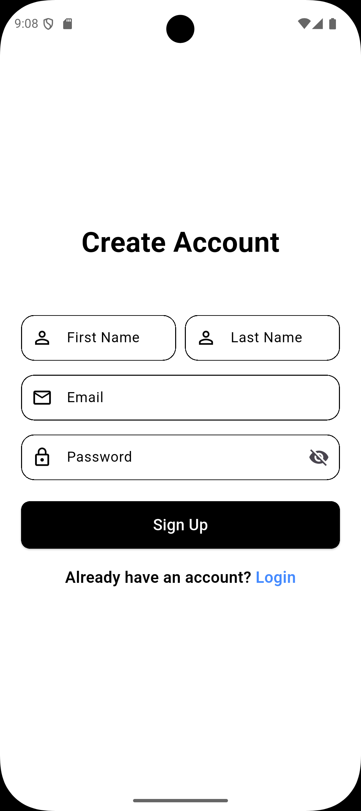
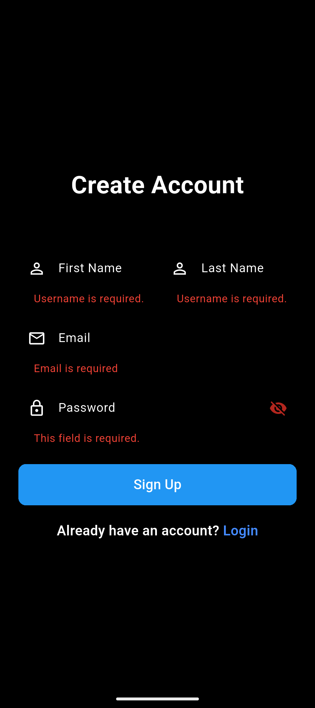
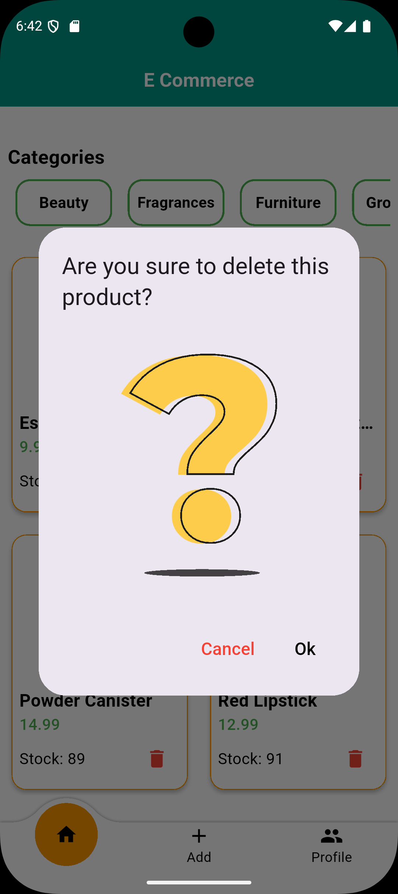
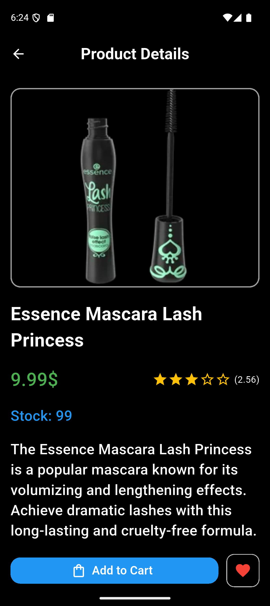
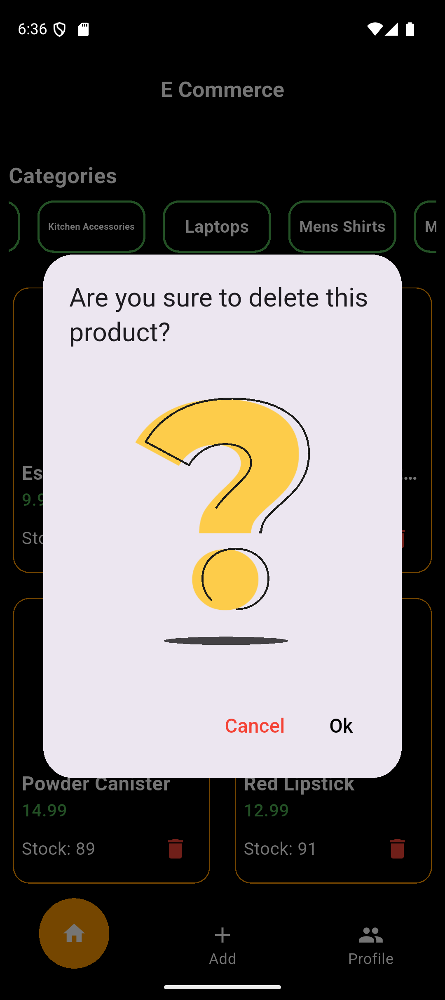
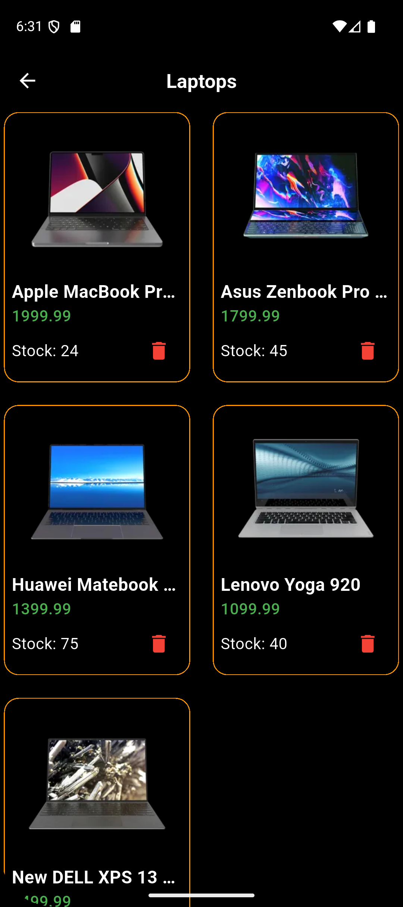

## E-Commerce App

 

---

## Table of Contents

* [App Overview](#app-overview)
* [Main Features](#main-features)
* [App Preview](#app-preview)
* [📸 Extra Screens](#-extra-screens)
* [Localization & Theming](#localization--theming)
* [🛠 Tech Stack](#-tech-stack)
* [Project Structure (key files)](#project-structure-key-files)
* [📦 Installation](#-installation)
* [Notes](#notes)

---

## App Overview

> **E-Commerce App** is a modern and fully-featured shopping application built with **Flutter**.
> It allows users to browse products by category, view detailed information, and for sellers to easily add new products using an intuitive interface.
> Designed with a clean **MVVM architecture** and **BLoC state management**, it ensures a scalable, maintainable, and high-performance experience.

This repository contains an example e-commerce client that showcases common mobile app requirements: state management, theming, localization, networking, and persistence.

---

## Main Features

### 🏠 Home Screen

* Shows all products in a grid/list.
* Category-based filtering and search.
* Product details screen with full information.

---

### ➕ Add Product

* Add new product via API (image, title, price, description, category).
* Form validation and API integration.

---

### 👤 Profile

* Edit user information.
* Change app theme (light/dark).
* Change language (localization).

---

## App Preview
|                  Login                    |                       Sign Up                        |                     Validations                     |
| ----------------------------------------: | :-----------------------------------------------------: | :---------------------------------------------: |
|  |  |  |

|                                      Home |                       Add Product                       |                     Profile                     |
| ----------------------------------------: | :-----------------------------------------------------: | :---------------------------------------------: |
|  |  |  |

|                                     Home |                       Add Product                      |                     Profile                    |
| ---------------------------------------: | :----------------------------------------------------: | :--------------------------------------------: |
|  |  |  |

---

## 📸 Extra Screens

|                                 Product Details |                 Delete Product                |                Products by Category                |
| ----------------------------------------------: | :-------------------------------------------: | :------------------------------------------------: |
|  |  |  |

|                                Product Details |                Delete Product                |                Products by Category               |
| ---------------------------------------------: | :------------------------------------------: | :-----------------------------------------------: |
|  |  |  |

---

## Localization & Theming

Localization in this app uses `flutter_localizations` and `intl`.
AR/EN translations are kept under `lib/l10n/` and generated files live under `lib/generated/`.

Theming is provided via a `Cubit` (`app_theme_cubit.dart`) with custom light and dark theme data (`app_theme_data.dart`).
The app includes UI to toggle theme and demonstrates both dark and light screenshots in `app_shots` (e.g., `home_dark.png` / `home_light.png`).

---

## 🛠 Tech Stack

* 
* 
* **Architecture:** MVVM Architecture
* **State Management:** BLoC / Cubit
* **Networking:** Dio
* **Storage:** Shared Preferences
* **Localization:** flutter_localizations + intl
* **Theming:** Custom Light & Dark Themes

---

## Project Structure (key files)

The app follows the **Clean MVVM Architecture** pattern for scalability and separation of concerns.

```
lib/
├── core/
│   ├── api/
│   ├── helper/
│   ├── locale/
│   ├── theme/
│   └── utils/
├── features/
│   ├── auth/
│   ├── main/
│   ├── home/
│   ├── add_product/
│   └── profile/
└── main.dart
```

* **BLoC (Cubit)** for state management
* **Dio** for API integration
* **Shared Preferences** for caching user data and settings

---

## 📦 Installation

### 1. Clone the repository

```bash
git clone https://github.com/KarimTamer74/nti-e-commerce.git
cd nti-e-commerce
```

### 2. Install dependencies

```bash
flutter pub get
```

### 3. Run the app

```bash
flutter run
```

---

## Notes

* API endpoints and network configuration live in `lib/features/*/data/api_service/api_services.dart`. Update them to point to your backend if necessary.
* Localization files are in `lib/l10n/`. If you edit ARB files, rebuild the app to pick up translations.
* Theme switching is handled by `lib/core/theme/app_theme_cubit.dart` and can be toggled via the profile/settings UI.
* APK / App download: not provided here (no download section).
* Screenshots are stored in `app_shots/` — both light and dark variants are included.

---

Happy hacking — open an issue or PR if you want help extending this sample.

---
