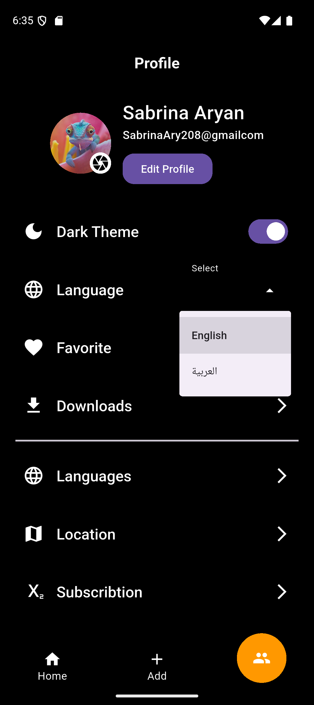

## E-Commerce App

 

A modern e‑commerce Flutter application with three main tabs: Home, Add Product and Profile. The app demonstrates an MVVM architecture with BLoC/Cubit state management, network integration using Dio, local storage with Shared Preferences, and localization via easy_localization.

---

## Table of Contents

- [App Overview](#app-overview)
- [Main Features](#main-features)
- [App Preview](#app-preview)
- [Localization & Theming](#localization--theming)
- [Tech Stack](#tech-stack)
- [Project Structure](#project-structure)
- [Installation](#installation)
- [Notes](#notes)

---

## App Overview

- Name: **E-Commerce App**
- Description: A modern e‑commerce Flutter application with three main tabs (Home, Add Product, Profile). Includes category-based product filtering, product details, and the ability to add new products via API.

This repository contains an example e‑commerce client that showcases common mobile app requirements: state management, theming, localization, networking, and persistence.

## Main Features

### 🏠 Home Screen
- Shows all products in a grid/list.
- Category-based filtering and search.
- Product details screen with full information.

Screenshots:


### ➕ Add Product
- Add new product via API (image, title, price, description, category).
- Form validation and API integration.

Screenshots:


### 👤 Profile
- Edit user information.
- Change app theme (light/dark).
- Change language (localization).

Screenshots:




## App Preview

| Home | Add Product | Profile |
|---:|:---:|:---:|
|  |  |  |

## Localization & Theming

Localization in this app uses `easy_localization` (plus `flutter_localizations` and `intl`). AR/EN translations are kept under `lib/l10n/` and generated files live under `lib/generated/`.

Theming is provided via a `Cubit` (`app_theme_cubit.dart`) with custom light and dark theme data (`app_theme_data.dart`). The app includes UI to toggle theme and demonstrates both dark and light screenshots in `app_shots` (e.g., `home_dark.png` / `home_light.png`).

Screens (theme examples):


## Tech Stack

- Flutter (UI)
- Dart (language)
- State management: BLoC / Cubit
- Architecture: MVVM
- Networking: Dio
- Local storage: Shared Preferences
- Localization: easy_localization + flutter_localizations + intl
- Theming: Custom Light & Dark themes (via Cubit)

---

## Project Structure (key files)

The project follows a feature-based MVVM layout under `lib/`. Key directories and files:

```
lib/
├─ main.dart
├─ core/
│  ├─ helper/
│  │  ├─ app_shared_preferences.dart
│  │  └─ app_static_lists.dart
│  ├─ locale/
│  │  ├─ locale_cubit.dart
│  │  └─ change_locale_widget.dart
│  ├─ shared_widgets/
│  │  └─ custom_text_form_field.dart
│  └─ theme/
│     ├─ app_theme_cubit.dart
│     ├─ app_theme_data.dart
│     └─ theme_switch_widget.dart
├─ features/
│  ├─ main/presentation/screen/main_screen.dart
│  ├─ home/
│  │  ├─ data/
│  │  │  └─ api_service/api_services.dart
│  │  │  └─ models/product_model.dart
│  │  └─ presentation/
│  │     ├─ screens/home_screen.dart
│  │     ├─ screens/product_details_screen.dart
│  │     ├─ screens/products_filter_screen.dart
│  │     ├─ widgets/product_card_widget.dart
│  │     └─ cubits/
│     │        ├─ products_cubit.dart
│     │        └─ categories_cubit.dart
│  ├─ add_product/
│  │  └─ presentation/screens/add_product_screen.dart
│  └─ profile/
│     ├─ data/models/user_info_model.dart
│     └─ presentation/screens/profile_screen.dart
├─ l10n/
│  ├─ intl_en.arb
│  └─ intl_ar.arb
└─ generated/
   └─ l10n.dart
```

## Installation

Prerequisites:

- Flutter SDK (stable channel) installed and on PATH
- A device or emulator available

Quick start:

```powershell
# from project root
flutter pub get
flutter run
```

Notes:

- API endpoints and network configuration live in `lib/features/*/data/api_service/api_services.dart`. Update them to point to your backend if necessary.
- Localization files are in `lib/l10n/`. If you edit ARB files rebuild the app to pick up translations.
- Theme switching is handled by `lib/core/theme/app_theme_cubit.dart` and can be toggled via the profile/settings UI.

## Notes

- APK / App download: not provided here (no download section).
- Screenshots are stored in `app_shots/` — both light and dark variants are included.

If you'd like, I can also:

- Add a small CONTRIBUTING.md with how to set up the backend mocks.
- Add a badge for CI or code coverage if you use a pipeline.

---

Happy hacking — open an issue or PR if you want help extending this sample.
# 🛍️ E-Commerce App


> **E-Commerce App** is a modern and fully-featured shopping application built with **Flutter**.
> It allows users to browse products by category, view detailed information, and for sellers to easily add new products using an intuitive interface.
> Designed with a clean **MVVM architecture** and **BLoC state management**, it ensures a scalable, maintainable, and high-performance experience.

---

## ✨ Features

### 🏠 Home Screen

* Displays all available products from the API.
* Supports category-based filtering — view products by selected category.
* Product detail screen with complete product info, images, and price.


---

### ➕ Add Product

* Add new products using API integration.
* Supports product name, description, category, stock, price, color, and more.
* Displays proper success and error handling via **BLoC** states.


---

### 👤 Profile

* View and manage your account information.
* Edit your name, email, and profile image.
* Includes app **Theming** (Light/Dark mode toggle).
* Supports full **Localization** (multi-language interface).


---

## 🌐 Localization & Theming

* Multi-language support using **easy_localization**.
* Dynamic **Dark/Light Mode** with smooth transitions.
* Saved user preferences using **SharedPreferences**.


---

## 🧱 Architecture

The app follows the **Clean MVVM Architecture** pattern for scalability and separation of concerns.

```
lib/
├── core/
│   ├── api/
│   ├── helper/
│   ├── locale/
│   ├── theme/
│   └── utils/
├── features/
│   ├── auth/
    └── main/
│   ├── home/
│   ├── add_product/
│   └── profile/
└── main.dart
```

* **BLoC (Cubit)** for state management
* **Dio** for API integration
* **Shared Preferences** for caching user data and settings

---

## 🛠 Tech Stack

- 
- 
- **Architecture:** MVVM Architecture  
- **State Management:** BLoC / Cubit  
- **Networking:** Dio  
- **Storage:** Shared Preferences  
- **Localization:** flutter_localizations + intl  
- **Theming:** Custom Light & Dark Themes  


---

## 📦 Installation

### 1. Clone the repository

```bash
git clone https://github.com/KarimTamer74/nti-e-commerce.git
cd nti-e-commerce
```

### 2. Install dependencies

```bash
flutter pub get
```

### 3. Run the app

```bash
flutter run
```

---

## 📸 App Preview

| Home                               | Add Product                              | Profile                                  |
| ---------------------------------- | ---------------------------------------- | ---------------------------------------- |
|  |  |  |

---

## 💡 Future Enhancements

* 🔍 Search & filter functionality
* 🛒 Shopping cart integration
* 📱 Upload APK and host demo link

---
